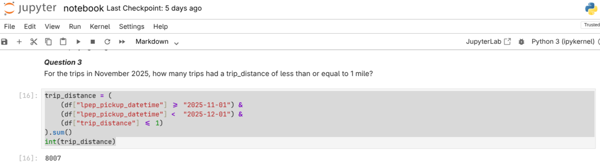
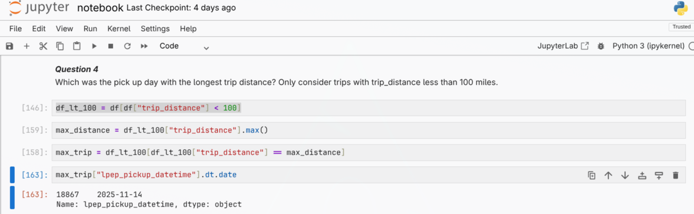

# Module 1 Homework: Docker & SQL

## Question 1. Understanding docker first run

Run docker with the `python:3.13` image in an interactive mode, use the entrypoint `bash`.
```
docker run --rm -it python:3.13 bash
python -m pip --version
```
What's the version of pip in the python:3.13 image?
- 25.3  <---
- 24.3.1
- 24.2.1
- 23.3.1

## Question 2. Understanding docker composing
```
services:
  db:
    container_name: postgres
    image: postgres:17-alpine
    environment:
      POSTGRES_USER: 'postgres'
      POSTGRES_PASSWORD: 'postgres'
      POSTGRES_DB: 'ny_taxi'
    ports:
      - '5432:5432'
    volumes:
      - vol-pgdata:/var/lib/postgresql/data

  pgadmin:
    container_name: pgadmin
    image: dpage/pgadmin4:latest
    environment:
      PGADMIN_DEFAULT_EMAIL: "pgadmin@pgadmin.com"
      PGADMIN_DEFAULT_PASSWORD: "pgadmin"
    ports:
      - "8080:80"
    volumes:
      - vol-pgadmin_data:/var/lib/pgadmin  

volumes:
  vol-pgdata:
    name: vol-pgdata
  vol-pgadmin_data:
    name: vol-pgadmin_data
```
Given the docker-compose.yaml, what is the hostname and port that pgadmin should use to connect to the postgres database?
- postgres:5433
- localhost:5432
- db:5433
- postgres:5432
- db:5432 <---

## Question 3.

```
trip_distance = (
    (df["lpep_pickup_datetime"] >= "2025-11-01") &
    (df["lpep_pickup_datetime"] <  "2025-12-01") &
    (df["trip_distance"] <= 1)
).sum()
int(trip_distance)
```
<p align="center">
  
</p>

Question 3. For the trips in November 2025, how many trips had a trip_distance of less than or equal to 1 mile? (1 point)
- 7,853
- 8,007 <---
- 8,254
- 8,421
  
## Question 4.

```
# filter trip_distance kurang dari 100
df_lt_100 = df[df["trip_distance"] < 100]
# cari trip paling jauh
max_distance = df_lt_100["trip_distance"].max()
# ambil 1 baris data yang trip paling jauh
max_trip = df_lt_100[df_lt_100["trip_distance"] == max_distance]
# ambil tanggalnya
max_trip["lpep_pickup_datetime"].dt.date
```
<p align="center">
  
</p>

Which was the pick up day with the longest trip distance? Only consider trips with `trip_distance` less than 100 miles (to exclude data errors).
- 2025-11-14 <---
- 2025-11-20
- 2025-11-23
- 2025-11-25


## Question 5. Biggest pickup zone
Join with table zone

```
SELECT
    z."Zone" AS pickup_zone,
    SUM(t.total_amount) AS total_rev
FROM green_taxi_trips t
JOIN zones z
    ON t."PULocationID" = z."LocationID"
WHERE DATE(t.lpep_pickup_datetime) = '2025-11-18'
GROUP BY z."Zone"
ORDER BY total_rev DESC
LIMIT 1;
```
Question 5. Which was the pickup zone with the largest total_amount (sum of all trips) on November 18th, 2025? (1 point)
- East Harlem North <--
- East Harlem South
- Morningside Heights
- Forest Hills


## Question 6.


## Question 7.
